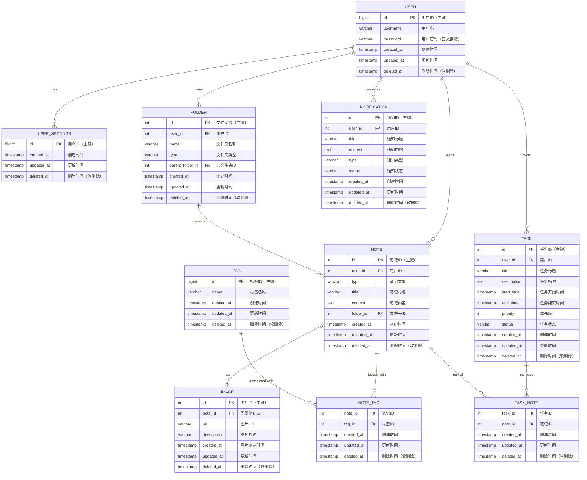

# 数据库设计说明书
## 1. 引言
### 1.1 编写目的

本数据库设计说明书是整个项目文档体系中至关重要的一部分，其编写具有多重目的。

- 对于数据库开发人员而言，它是一盏指引方向的明灯。通过详细阐述数据库的架构、数据模型、各种实体之间的关系以及所采用的技术选型，为开发过程提供了明确的路线图。开发人员能够依据此说明书有条不紊地创建数据库表结构、设计存储过程、建立索引和视图等数据库对象，确保开发工作准确、高效地开展，避免因设计不清晰而导致的反复修改和延误。

- 在项目团队沟通协作方面，它是不可或缺的沟通桥梁。项目团队通常包括系统分析师、开发人员、测试人员、运维人员等不同角色，大家都需要对数据库有统一且清晰的理解。这份说明书能够让不同角色的人员围绕数据库设计达成共识，便于各阶段工作的顺利衔接。例如，系统分析师可据此向开发人员准确传达业务需求，测试人员可依据设计规划准备全面的测试方案，以检查数据库功能和性能是否满足要求，运维人员则能了解数据库架构，为后期的部署和维护做好准备。

- 从数据库的生命周期角度来看，它是保障数据库可维护性和可扩展性的关键文档。在数据库长期运行过程中，可能会面临性能问题、功能变更、业务扩展等多种情况。维护人员可以凭借这份设计说明书深入了解数据库的初始设计意图，迅速定位问题根源，实施有效的优化和修改措施。当需要对系统进行功能扩展时，该说明书能够帮助评估新功能对数据库的影响，指导数据库结构的合理调整，确保数据库在不断变化的业务环境中始终保持稳定和可靠。

- 此外，它也是对项目数据库相关需求的正式记录。明确了数据的存储格式、存储量预估、数据之间的逻辑关系、数据完整性约束条件以及安全需求等。这些内容将模糊的业务需求转化为清晰、可量化的数据库设计要求，确保数据库设计与项目的整体目标紧密契合，避免需求理解偏差所带来的潜在风险。

### 1.2 术语及缩写解释

#### 1.2.1 术语解释
| 术语 | 术语解释 |
| ---------------- | ------------------------------------------------------------ |
| **Entity**       | **即“实体”，在数据库设计中，表示现实世界中可区别于其他对象的 “事物” 或 “概念”。** |
| **Attribute**    | **即“属性”，是实体所具有的某一特性。**                       |
| **Relationship** | **即“关系”，描述实体之间的联系。常见的关系类型包括一对一、一对多、多对多。** |
| **Primary Key**  | **即“主键”，是表中的一个或多个字段，其值能够唯一地标识表中的每一行记录。** |
| **Foreign Key**  | **即“外键”，用于建立两个表之间的关联，它是一个表中的字段，其值指向另一个表中的主键。** |

#### 1.2.2 缩写解释
| 缩写 | 缩写解释 |
| ---------- | ------------------------------------------------------------ |
| **DBMS**   | **数据库管理系统，Database Management System**               |
| **SQL**    | **结构化查询语言，Structured Query Language**                |
| **ERD**    | **实体 - 关系图，Entity - Relationship Diagram**             |
| **ACID**   | **数据库事务的四个特性，Atomicity, Consistency, Isolation, Durability** |
| **PBKDF2** | **是一种基于密码的密钥派生函数，Password - Based Key Derivation Function 2** |
| **HMAC**   | **即基于哈希的消息认证码，Hash - based Message Authentication Code** |

## 2. 数据库环境说明

### 硬件环境

- 服务器配置：

  - **处理器**：英特尔超绝挤牙膏11代处理器 i7-11800，基于 Tiger Lake - H40 架构。拥有 8 个核心，16 线程，基准频率为 2.3GHz，最大睿频可达 4.6GHz，可提供稳定且高效的运算能力，满足 MySQL 数据库在处理复杂查询和高并发操作时的计算需求]。
  - **内存**：16GB DDR4 内存，频率为 4800MHz。足够的内存可保障 MySQL 在运行过程中有效地缓存数据，减少磁盘 I/O 操作，提升数据访问和处理速度]。
  - 存储设备：

    - **硬盘类型和容量**：采用 500GB 的固态硬盘（SSD）作为系统盘和关键数据存储盘，SSD 的高速读写特性有利于 MySQL 的快速启动和数据的快速存储与读取；同时配备 4TB 的机械硬盘（HDD）用于存储大量的历史数据和备份数据]。
- 网络环境：

  - **网络带宽**：服务器连接到校园内部的超绝FZU校园网，可保证在使用 Django 开发的应用与 MySQL 数据库交互过程中，数据传输的高效性，减少网络延迟对数据操作的影响]。

### 软件环境

- 数据库管理系统（DBMS）：

  - **DBMS 名称和版本**：本系统使用 MySQL 8.0 作为数据库管理系统。MySQL 8.0 具有高性能、高可靠性和易用性等特点，支持丰富的数据类型和强大的查询功能，能够满足项目中数据存储和管理的需求。

  - **DBMS 配置参数**：
  - **内存相关参数**： innodb_buffer_pool_size 设置为 20GB，用于缓存 InnoDB 存储引擎的表数据和索引数据，提高数据读写性能；query_cache_size 根据实际情况设置为适当的值，以缓存查询结果，减少重复查询的开销]。
    - **存储相关参数**：设置数据文件的存储路径、大小限制等。innodb_data_file_path 配置为 ibdata1:10M:autoextend，确保数据文件有足够的空间存储和扩展数据。
  - **连接相关参数**：设置 max_connections 为 500，以满足预计的用户并发连接数量；同时配置合适的 wait_timeout 值，避免长时间空闲连接占用服务器资源。
- 设计工具：

  - **设计工具名称和版本**：使用 Django 4.2.1 作为数据库设计和开发的框架。Django 是一个高级 Python Web 框架，它提供了强大的数据库抽象层，能够方便地与 MySQL 数据库进行交互。通过其内置的 ORM（对象关系映射）功能，可以高效地设计数据库模型，减少手动编写 SQL 的工作量。
- 编程工具：

  - **编程工具名称和版本**：采用 Pycharm 2024.2.0.1 作为主要的编程工具。Pycharm 是一款功能强大的 Python 集成开发环境，它提供了智能代码补全、代码导航、调试等丰富的功能，方便开发人员使用 Python 编写与 MySQL 数据库交互的代码，提高开发效率。
  - **相关配置和插件**：通过 Navicat Premium 17 工具窗口可以方便地查看和操作 MySQL 数据库。。

## 3. 数据库命名规则

### 3.1**总体原则**

- **清晰性**：数据库命名应该清晰地反映数据库的主要用途、所属项目或业务领域。这样，开发人员、运维人员和其他相关人员在看到数据库名称时，能够快速理解其功能。
- **一致性**：在整个项目或组织内部，数据库命名应该遵循统一的规则。这有助于减少混乱，提高代码和系统的可读性，方便团队成员之间的沟通和协作。
- **可扩展性**：命名规则应该考虑到未来可能的扩展和变化。例如，当新的业务功能添加到系统中时，数据库名称能够自然地适应这种变化，而不需要进行大规模的重命名。

### 3.2具体规则（根据网站功能命名）

#### 1. 表命名规则

- 表名统一使用**小写字母**和**下划线**（snake_case）格式。
- 名词尽量采用**单数形式**，如 `user`、`folder`、`note`。
- 多对多关联表命名格式为 `表1_表2`，如 `note_tag`、`task_note`。

#### 2. 字段命名规则

- **主键字段**统一命名为 `id`，类型根据需求选择 `bigint` 或 `int`，自增设置为 `auto_increment`。
- **外键字段**命名格式为 `关联表名_id`，如 `user_id`、`note_id`。
- **时间戳字段**统一使用以下命名：
  - `created_at`：记录数据创建时间，类型为 `timestamp`，默认值为 `current_timestamp`。
  - `updated_at`：记录数据更新时间，类型为 `timestamp`，默认值为 `current_timestamp`，更新时自动更新。
  - `deleted_at`：用于软删除标记，类型为 `timestamp`，默认值为 `NULL`。

#### 3. 字段类型命名规则

- **字符串类型**使用 `varchar(length)`，如 `username`（长度 50），`title`（长度 100）。
- **长文本内容**使用 `text`，如 `content` 字段。
- **数值类型**使用 `int` 或 `bigint`，根据字段需求决定。
- **布尔类型**字段通常使用 `tinyint(1)`，例如 `is_active`。

#### 4. 约束规则

- **主键约束**：所有主键字段命名为 `id`，并设置为 `primary key`。
- **外键约束**：所有外键字段命名格式为 `关联表名_id`，并指定 `on delete cascade` 或 `on delete set null` 规则。
- **唯一约束**：如有唯一性要求，字段加上 `unique` 约束，例如 `tag` 表中的 `name`。

#### 5. 索引命名规则

- 索引名称格式为 `idx_表名_字段名`，例如 `idx_user_username` 表示 `user` 表中的 `username` 字段的索引。

---

此命名规则可确保数据库设计的一致性和可读性，便于后期维护和扩展。


## 4. 逻辑设计

### 概念设计

1. **User**
   - 用户（`用户ID` **[主键]**，用户名，用户密码，账户创建时间）
   - **描述**：存储用户的基本信息
   - **关系**：
     - 一对多：一个用户可以有多个笔记（Note）。
     - 一对多：一个用户可以有多个任务（Task）。
     - 一对多：一个用户可以有多个通知（Notification）。
     - 一对一：每个用户有一套用户设置（UserSettings）。

2. **Note**
   - 笔记（`笔记ID` **[主键]**，`用户ID` **[外键]**，笔记类型（用于区别笔记和写作），笔记标题，笔记内容，笔记创建时间，笔记最后修改时间，`文件夹ID` **[外键]**）
   - **描述**：存储用户创建的笔记信息
   - **关系**：
     - 多对一：多个笔记属于一个用户。
     - 多对多：笔记与标签（Tag）之间的关系，通过NoteTag表实现。
     - 一对多：一个笔记可以有多个图片（Image）。

3. **Image**
   - 图片（`图片ID` **[主键]**，`所属笔记ID` **[外键]**，URL，图片上传时间，图片描述）
   - **描述**：存储笔记中的图片信息
   - **关系**：
     - 多对一：多个图片属于一个笔记。

4. **Task**
   - 任务（`任务ID` **[主键]**，`用户ID` **[外键]**，任务标题，任务描述，任务开始时间，任务结束时间，优先级，任务状态）
   - **描述**：存储用户的任务信息
   - **关系**：
     - 多对一：多个任务属于一个用户。
     - 多对多：任务与笔记（Note）之间的关系，通过TaskNote表实现。

5. **Notification**
   - 通知（`通知ID` **[主键]**，`用户ID` **[外键]**，通知标题，通知内容，通知类型，通知状态，通知创建时间，通知更新时间）
   - **描述**：存储系统发送给用户的通知
   - **关系**：
     - 多对一：多个通知属于一个用户。

6. **Tag**
   - 标签（`标签ID` **[主键]**，标签名称）
   - **描述**：存储标签信息，用于分类和搜索
   - **关系**：
     - 多对多：标签与笔记、任务之间的关系，通过各自的关联表实现。

7. **Folder**
   - 文件夹（`文件夹ID` **[主键]**，`用户ID` **[外键]**，文件夹名称，文件夹类型，创建时间，更新时间，父文件夹ID）
   - **描述**：用于组织笔记的文件夹结构
   - **关系**：
     - 一对多：一个文件夹可以包含多个笔记和子文件夹。
     - 多对一：笔记可以属于一个文件夹。

8. **UserSettings**（待定）
   - 用户设置（`用户ID` **[主键，外键]**，其他待定字段）
   - **描述**：存储用户的个性化设置
   - **关系**：
     - 一对一：每个用户有一套用户设置。

9. **NoteTag**
   - 表示笔记与标签的多对多关系
   - 字段（`笔记ID` **[外键]**，`标签ID` **[外键]**）
   - **描述**：连接笔记和标签的多对多关系表

10. **TaskNote**
   - 表示任务与笔记的多对多关系
   - 字段（`任务ID` **[外键]**，`笔记ID` **[外键]**）
   - **描述**：连接笔记和任务的多对多关系表

## 5. 物理设计
### 5.1 表汇总
| 表名               | 描述               | 主键           | 外键                                       |
|--------------------|--------------------|----------------|--------------------------------------------|
| `user`            | 用户信息表         | `id`           | 无                                         |
| `user_settings`   | 用户设置表         | `id`           | `id` -> `user`.`id` (级联删除)             |
| `folder`          | 文件夹信息表       | `id`           | `user_id` -> `user`.`id` (级联删除), `parent_folder_id` -> `folder`.`id` (级联删除) |
| `note`            | 笔记信息表         | `id`           | `user_id` -> `user`.`id` (级联删除), `folder_id` -> `folder`.`id` (置空)             |
| `image`           | 图片信息表         | `id`           | `note_id` -> `note`.`id` (级联删除)        |
| `task`            | 任务信息表         | `id`           | `user_id` -> `user`.`id` (级联删除)        |
| `notification`    | 通知信息表         | `id`           | `user_id` -> `user`.`id` (级联删除)        |
| `tag`             | 标签信息表         | `id`           | 无                                         |
| `note_tag`        | 笔记标签关系表     | (`note_id`, `tag_id`) | `note_id` -> `note`.`id` (级联删除), `tag_id` -> `tag`.`id` (级联删除) |
| `task_note`       | 任务笔记关系表     | (`task_id`, `note_id`) | `task_id` -> `task`.`id` (级联删除), `note_id` -> `note`.`id` (级联删除) |

#### 表描述

1. **user**：用户信息表，存储用户的基本信息如用户名和密码。
2. **user_settings**：用户设置表，存储与用户相关的配置，使用用户ID作为主键，关联到 `user` 表。
3. **folder**：文件夹信息表，用于组织用户的文件夹结构，可包含子文件夹。
4. **note**：笔记信息表，存储用户笔记的信息，支持按文件夹归类。
5. **image**：图片信息表，存储与笔记相关的图片信息。
6. **task**：任务信息表，存储与用户相关的任务信息，包括标题、描述、时间等。
7. **notification**：通知信息表，存储与用户相关的通知信息。
8. **tag**：标签信息表，用于管理笔记的标签。
9. **note_tag**：笔记标签关系表，存储笔记与标签的多对多关系。
10. **task_note**：任务笔记关系表，存储任务与笔记的多对多关系。
#### ER图
##### Crow‘s foot方法

##### chen方法


#### 建表语句
```sql
create table `ez-note`.`user`(
    `id` bigint not null auto_increment comment 'ID',
    `username` varchar(50) not null comment '用户名',
    `password` varchar(100) not null comment '用户密码（密文存储）',
    `created_at` timestamp              NOT NULL           DEFAULT current_timestamp ,
    `updated_at` timestamp              NOT NULL           DEFAULT current_timestamp ON UPDATE current_timestamp,
    `deleted_at` timestamp              NULL               DEFAULT NULL,
    primary key (`id`)
) engine=InnoDB default charset=utf8mb4;


create table `ez-note`.`user_settings`(
    `id` bigint not null comment '用户ID',
    primary key (`id`),
    `created_at` timestamp              NOT NULL           DEFAULT current_timestamp ,
    `updated_at` timestamp              NOT NULL           DEFAULT current_timestamp ON UPDATE current_timestamp,
    `deleted_at` timestamp              NULL               DEFAULT NULL,
    constraint `user_id` foreign key (`id`) references `user` (`id`) on delete cascade
) engine=InnoDB default charset=utf8mb4;


create table `ez-note`.`folder`(
    `id` int not null auto_increment comment '文件夹ID',
    `user_id` int not null comment '用户ID',
    `name` varchar(100) comment '文件夹名称',
    `type` varchar(50) comment '文件夹类型',
    `parent_folder_id` int comment '父文件夹ID',
    `created_at` timestamp              NOT NULL           DEFAULT current_timestamp ,
    `updated_at` timestamp              NOT NULL           DEFAULT current_timestamp ON UPDATE current_timestamp,
    `deleted_at` timestamp              NULL               DEFAULT NULL,
    primary key (`id`),
    constraint `folder_user` foreign key (`user_id`) references `user` (`id`) on delete cascade,
    constraint `parent_folder` foreign key (`parent_folder_id`) references `folder` (`id`) on delete cascade
) engine=InnoDB default charset=utf8mb4;


create table `ez-note`.`note`(
    `id` int not null auto_increment comment '笔记ID',
    `user_id` int not null comment '用户ID',
    `type` varchar(50) comment '笔记类型',
    `title` varchar(100) comment '笔记标题',
    `content` text comment '笔记内容',
    `folder_id` int comment '文件夹ID',
    `created_at` timestamp              NOT NULL           DEFAULT current_timestamp ,
    `updated_at` timestamp              NOT NULL           DEFAULT current_timestamp ON UPDATE current_timestamp,
    `deleted_at` timestamp              NULL               DEFAULT NULL,
    primary key (`id`),
    constraint `note_user_id` foreign key (`user_id`) references `user` (`id`) on delete cascade,
    constraint `note_folder_id` foreign key (`folder_id`) references `folder` (`id`) on delete set null
) engine=InnoDB default charset=utf8mb4;


create table `ez-note`.`image`(
    `id` int not null auto_increment comment '图片ID',
    `note_id` int not null comment '所属笔记ID',
    `url` varchar(512) comment '图片url',
    `description` varchar(255) comment '图片描述',
    `created_at` timestamp              NOT NULL           DEFAULT current_timestamp comment '图片创建（上传）时间',
    `updated_at` timestamp              NOT NULL           DEFAULT current_timestamp ON UPDATE current_timestamp,
    `deleted_at` timestamp              NULL               DEFAULT NULL,
    primary key (`id`),
    constraint `image_note` foreign key (`note_id`) references `note` (`id`) on delete cascade
) engine=InnoDB default charset=utf8mb4;


create table `ez-note`.`task`(
    `id` int not null auto_increment comment '任务ID',
    `user_id` int not null comment '用户ID',
    `title` varchar(100) comment '任务标题',
    `description` text comment '任务描述',
    `start_time` timestamp comment '任务开始时间',
    `end_time` timestamp comment '任务结束时间',
    `priority` int comment '优先级',
    `status` varchar(50) comment '任务状态',
    `created_at` timestamp              NOT NULL           DEFAULT current_timestamp ,
    `updated_at` timestamp              NOT NULL           DEFAULT current_timestamp ON UPDATE current_timestamp,
    `deleted_at` timestamp              NULL               DEFAULT NULL,
    primary key (`id`),
    constraint `task_user` foreign key (`user_id`) references `user` (`id`) on delete cascade
) engine=InnoDB default charset=utf8mb4;


create table `ez-note`.`notification`(
    `id` int not null auto_increment comment '通知ID',
    `user_id` int not null comment '用户ID',
    `title` varchar(100) comment '通知标题',
    `content` text comment '通知内容',
    `type` varchar(50) comment '通知类型',
    `status` varchar(50) comment '通知状态',
    `created_at` timestamp              NOT NULL           DEFAULT current_timestamp ,
    `updated_at` timestamp              NOT NULL           DEFAULT current_timestamp ON UPDATE current_timestamp,
    `deleted_at` timestamp              NULL               DEFAULT NULL,
    primary key (`id`),
    constraint `notification_user` foreign key (`user_id`) references `user` (`id`) on delete cascade
) engine=InnoDB default charset=utf8mb4;


create table `ez-note`.`tag`(
    `id` bigint not null auto_increment comment '标签ID',
    `name` varchar(50) unique comment '标签名称',
    `created_at` timestamp              NOT NULL           DEFAULT current_timestamp ,
    `updated_at` timestamp              NOT NULL           DEFAULT current_timestamp ON UPDATE current_timestamp,
    `deleted_at` timestamp              NULL               DEFAULT NULL,
    primary key (`id`)
) engine=InnoDB default charset=utf8mb4;


create table `ez-note`.`note_tag`(
    `note_id` int not null comment '笔记ID',
    `tag_id` int not null comment '标签ID',
    `created_at` timestamp              NOT NULL           DEFAULT current_timestamp ,
    `updated_at` timestamp              NOT NULL           DEFAULT current_timestamp ON UPDATE current_timestamp,
    `deleted_at` timestamp              NULL               DEFAULT NULL,
    primary key (`note_id`, `tag_id`),
    constraint `note_tag_note` foreign key (`note_id`) references `note` (`id`) on delete cascade,
    constraint `note_tag_tag` foreign key (`tag_id`) references `tag` (`id`) on delete cascade
) engine=InnoDB default charset=utf8mb4;


create table `ez-note`.`task_note`(
    `task_id` int not null comment '任务ID',
    `note_id` int not null comment '笔记ID',
    `created_at` timestamp              NOT NULL           DEFAULT current_timestamp ,
    `updated_at` timestamp              NOT NULL           DEFAULT current_timestamp ON UPDATE current_timestamp,
    `deleted_at` timestamp              NULL               DEFAULT NULL,
    primary key (`task_id`, `note_id`),
    constraint `task_note_task_id` foreign key (`task_id`) references `task` (`id`) on delete cascade,
    constraint `task_note_note_id` foreign key (`note_id`) references `note` (`id`) on delete cascade
) engine=InnoDB default charset=utf8mb4;

```


### 5.2 表结构设计

#### 5.2.1`user` 表

| 字段名       | 数据类型         | 是否为空 | 默认值                | 描述               |
|--------------|------------------|----------|-----------------------|--------------------|
| `id`         | `bigint`         | 否       | `auto_increment`      | 用户ID（主键）     |
| `username`   | `varchar(50)`    | 否       |                       | 用户名             |
| `password`   | `varchar(100)`   | 否       |                       | 用户密码（密文存储）|
| `created_at` | `timestamp`      | 否       | `current_timestamp`   | 创建时间           |
| `updated_at` | `timestamp`      | 否       | `current_timestamp` on update `current_timestamp` | 更新时间 |
| `deleted_at` | `timestamp`      | 是       | `NULL`                | 删除时间（软删除） |

#### 5.2.2`user_settings` 表

| 字段名       | 数据类型         | 是否为空 | 默认值                | 描述               |
|--------------|------------------|----------|-----------------------|--------------------|
| `id`         | `bigint`         | 否       |                       | 用户ID（主键）     |
| `created_at` | `timestamp`      | 否       | `current_timestamp`   | 创建时间           |
| `updated_at` | `timestamp`      | 否       | `current_timestamp` on update `current_timestamp` | 更新时间 |
| `deleted_at` | `timestamp`      | 是       | `NULL`                | 删除时间（软删除） |

#### 5.2.3`folder` 表

| 字段名           | 数据类型         | 是否为空 | 默认值                | 描述                |
|------------------|------------------|----------|-----------------------|---------------------|
| `id`             | `int`            | 否       | `auto_increment`      | 文件夹ID（主键）    |
| `user_id`        | `int`            | 否       |                       | 用户ID              |
| `name`           | `varchar(100)`   | 是       |                       | 文件夹名称          |
| `type`           | `varchar(50)`    | 是       |                       | 文件夹类型          |
| `parent_folder_id` | `int`          | 是       |                       | 父文件夹ID          |
| `created_at`     | `timestamp`      | 否       | `current_timestamp`   | 创建时间            |
| `updated_at`     | `timestamp`      | 否       | `current_timestamp` on update `current_timestamp` | 更新时间 |
| `deleted_at`     | `timestamp`      | 是       | `NULL`                | 删除时间（软删除）  |

#### 5.2.4`note` 表

| 字段名       | 数据类型         | 是否为空 | 默认值                | 描述               |
|--------------|------------------|----------|-----------------------|--------------------|
| `id`         | `int`            | 否       | `auto_increment`      | 笔记ID（主键）     |
| `user_id`    | `int`            | 否       |                       | 用户ID             |
| `type`       | `varchar(50)`    | 是       |                       | 笔记类型           |
| `title`      | `varchar(100)`   | 是       |                       | 笔记标题           |
| `content`    | `text`           | 是       |                       | 笔记内容           |
| `folder_id`  | `int`            | 是       |                       | 文件夹ID           |
| `created_at` | `timestamp`      | 否       | `current_timestamp`   | 创建时间           |
| `updated_at` | `timestamp`      | 否       | `current_timestamp` on update `current_timestamp` | 更新时间 |
| `deleted_at` | `timestamp`      | 是       | `NULL`                | 删除时间（软删除） |

#### 5.2.5`image` 表

| 字段名       | 数据类型         | 是否为空 | 默认值                | 描述               |
|--------------|------------------|----------|-----------------------|--------------------|
| `id`         | `int`            | 否       | `auto_increment`      | 图片ID（主键）     |
| `note_id`    | `int`            | 否       |                       | 所属笔记ID         |
| `url`        | `varchar(512)`   | 是       |                       | 图片URL            |
| `description`| `varchar(255)`   | 是       |                       | 图片描述           |
| `created_at` | `timestamp`      | 否       | `current_timestamp`   | 图片创建时间       |
| `updated_at` | `timestamp`      | 否       | `current_timestamp` on update `current_timestamp` | 更新时间 |
| `deleted_at` | `timestamp`      | 是       | `NULL`                | 删除时间（软删除） |

#### 5.2.6`task` 表

| 字段名       | 数据类型         | 是否为空 | 默认值                | 描述               |
|--------------|------------------|----------|-----------------------|--------------------|
| `id`         | `int`            | 否       | `auto_increment`      | 任务ID（主键）     |
| `user_id`    | `int`            | 否       |                       | 用户ID             |
| `title`      | `varchar(100)`   | 是       |                       | 任务标题           |
| `description`| `text`           | 是       |                       | 任务描述           |
| `start_time` | `timestamp`      | 是       |                       | 任务开始时间       |
| `end_time`   | `timestamp`      | 是       |                       | 任务结束时间       |
| `priority`   | `int`            | 是       |                       | 优先级             |
| `status`     | `varchar(50)`    | 是       |                       | 任务状态           |
| `created_at` | `timestamp`      | 否       | `current_timestamp`   | 创建时间           |
| `updated_at` | `timestamp`      | 否       | `current_timestamp` on update `current_timestamp` | 更新时间 |
| `deleted_at` | `timestamp`      | 是       | `NULL`                | 删除时间（软删除） |

#### 5.2.7`notification` 表

| 字段名       | 数据类型         | 是否为空 | 默认值                | 描述               |
|--------------|------------------|----------|-----------------------|--------------------|
| `id`         | `int`            | 否       | `auto_increment`      | 通知ID（主键）     |
| `user_id`    | `int`            | 否       |                       | 用户ID             |
| `title`      | `varchar(100)`   | 是       |                       | 通知标题           |
| `content`    | `text`           | 是       |                       | 通知内容           |
| `type`       | `varchar(50)`    | 是       |                       | 通知类型           |
| `status`     | `varchar(50)`    | 是       |                       | 通知状态           |
| `created_at` | `timestamp`      | 否       | `current_timestamp`   | 创建时间           |
| `updated_at` | `timestamp`      | 否       | `current_timestamp` on update `current_timestamp` | 更新时间 |
| `deleted_at` | `timestamp`      | 是       | `NULL`                | 删除时间（软删除） |

#### 5.2.8`tag` 表

| 字段名       | 数据类型         | 是否为空 | 默认值                | 描述               |
|--------------|------------------|----------|-----------------------|--------------------|
| `id`         | `bigint`         | 否       | `auto_increment`      | 标签ID（主键）     |
| `name`       | `varchar(50)`    | 否       |                       | 标签名称           |
| `created_at` | `timestamp`      | 否       | `current_timestamp`   | 创建时间           |
| `updated_at` | `timestamp`      | 否       | `current_timestamp` on update `current_timestamp` | 更新时间 |
| `deleted_at` | `timestamp`      | 是       | `NULL`                | 删除时间（软删除） |

#### 5.2.9`note_tag` 表

| 字段名       | 数据类型         | 是否为空 | 默认值                | 描述               |
|--------------|------------------|----------|-----------------------|--------------------|
| `note_id`    | `int`            | 否       |                       | 笔记ID             |
| `tag_id`     | `int`            | 否       |                       | 标签ID             |
| `created_at` | `timestamp`      | 否       | `current_timestamp`   | 创建时间           |
| `updated_at` | `timestamp`      | 否       | `current_timestamp` on update `current_timestamp` | 更新时间 |
| `deleted_at` | `timestamp`      | 是       | `NULL`                | 删除时间（软删除） |

#### 5.2.10`task_note` 表

| 字段名       | 数据类型         | 是否为空 | 默认值                | 描述               |
|--------------|------------------|----------|-----------------------|--------------------|
| `task_id`    | `int`            | 否       |                       | 任务ID             |
| `note_id`    | `int`            | 否       |                       | 笔记ID             |
| `created_at` | `timestamp`      | 否       | `current_timestamp`   | 创建时间           |
| `updated_at` | `timestamp`      | 否       | `current_timestamp` on update `current_timestamp` | 更新时间 |
| `deleted_at` | `timestamp`      | 是       | `NULL`                | 删除时间（软删除） |

## 6. 安全性 
- 密码加密模块

### 模块目标
该模块的设计目标是通过密码加密机制，防止未经授权的访问和恶意破解，确保用户密码在数据库中的安全存储。加密机制能够有效防范暴力破解、彩虹表攻击和数据库泄露后的潜在风险。

### 加密算法选型
由于采用 Django 框架，因此 PBKDF2（Password-Based Key Derivation Function 2）作为默认的密码加密算法，原因如下：

- **PBKDF2** 是由 **NIST**（美国国家标准与技术研究院）认证的标准算法，安全性高，并广泛应用于大规模项目。
- PBKDF2 基于 **HMAC**（Hash-based Message Authentication Code）算法，具有较强的抗暴力破解能力。通过增加迭代次数来增加破解难度，确保数据的长期安全性。

### 加密过程概述
Django 框架自动使用 PBKDF2 算法对用户密码进行加密，具体加密过程如下：

1. **生成随机盐值（Salt）**：每次用户设置或修改密码时，Django 自动生成一个唯一的随机盐值，确保即使用户密码相同，加密结果也不同。
2. **多次迭代哈希计算**：Django 的 PBKDF2 默认迭代次数为 260,000 次（可自定义），以增加计算复杂度，使得暴力破解成本增加。
3. **存储加密密码格式**：加密后的密码以字符串格式存储，包含以下信息：
   - 加密算法名称（如 `pbkdf2_sha256`）
   - 迭代次数（如 `260000`）
   - 随机盐值
   - 哈希结果（加密后的密码）

### 自定义配置说明
Django 允许在 `settings.py` 中自定义 PBKDF2 算法的迭代次数，以进一步增强密码保护。可以通过调整 `PBKDF2_ITERATIONS` 配置项来更改迭代次数，系统管理员可以根据需求选择适当的迭代次数以平衡安全性和性能需求。

### 密码验证
Django 自动处理密码验证过程，避免手动比对。系统在用户登录时，会根据数据库中的加密算法和盐值验证输入的密码是否匹配，确保验证过程的安全和准确性。

### 附加的安全措施
为了确保密码加密模块具备可扩展性和更高的安全性，Django 还支持其他加密算法。可在 `PASSWORD_HASHERS` 配置中添加其他算法（如 `bcrypt`、`Argon2`），以应对未来安全需求变化。

## 7. 存储过程一览表
## 8. 数据库的备份策略和方式
### 8.1 备份策略
### 8.2 备份方式
