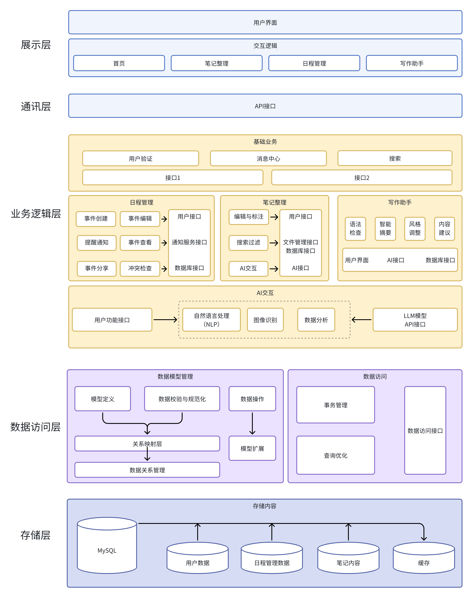

# 系统设计说明书
## 1. 引言
### 1.1 编写目的
该系统设计说明书旨在详细描述智能学习网站的设计思路、架构和实现方式，为后续开发和维护提供清晰的技术参考。
本文档的目标读者包括开发人员、测试人员、老师、同学以及助教等相关人员。
## 2. 项目概要
###	2.1 建设背景
随着无纸化学习的普及和大语言模型技术的快速发展，传统学习软件亟待革新，同时也蕴藏着巨大的创新潜力。
在此背景下，智能学习平台的需求愈加明显，能够满足个性化、交互性强的学习体验成为教育领域的趋势。智能化的学习网站通过引入人工智能等技术，可以帮助学生更加高效地整理，使学习过程更加灵活和智能化，进而提升学习效果和用户体验。
###	2.2 建设目标
本项目旨在开发一个基于大语言模型（LLM）接口的软件，以提升用户在日常工作和生活中的体验。通过集成大语言模型，为传统学习软件提供智能化的功能，满足用户对高效、便捷的需求。
通过写作助手、日程管理、智能笔记整理，提升用户的学习体验。

## 3. 系统概述

### 3.1 服务器端
* 本项目的服务器端开发基于 Python 的 Django 框架。
  Django 是一个高效、快速的全栈 Web 框架，具备强大的数据库管理、URL 路由和表单处理功能，能够便捷地处理 API 请求、管理数据以及实现业务逻辑。通过使用 Django 框架，我们的服务器端可以有效地管理和处理来自客户端的请求，确保数据的快速传输和业务逻辑的顺畅运行。
* 大语言模型选择调用ChatGPT模型，以提供智能化学习系统的支撑功能。
  ChatGPT 可以提供强大的自然语言处理能力，通过分析和理解用户输入，智能生成摘要或者识别笔记内容等等，为用户提供智能化的学习体验和实时帮助。

### 3.2 客户端
* 客户端使用 Vue.js 框架进行开发。
  Vue.js 是一个轻量级、渐进式的 JavaScript 框架，特别适用于构建单页面应用。通过 Vue.js，前端可以实现灵活的响应式界面布局，确保界面美观并适应设备页面。同时可以使我们的项目平台页面切换、导航功能流畅，提升用户体验。
* 客户端通过 API 与服务器进行数据交互，实现了动态数据的实时获取与渲染。用户每次在前端触发的操作，例如提出AI学习请求或更新页面，都会通过 API 发送到服务器，从而实现数据的同步更新和动态内容呈现。

### 3.3 数据库平台
* 数据库平台选择 MySQL。
  MySQL是一个高效、可靠且广泛使用的关系型数据库管理系统，适用于处理大规模数据，并且具有优异的查询和存储性能。MySQL 数据库的扩展性使其能够满足未来数据量不断增加的需求，适合智能学习平台需要存储复杂数据结构的场景。
  同时，MySQL 的社区版具备开源特性，便于后续的个性化定制和功能拓展，使平台能够灵活应对学习过程中的多样化需求，提升整体的交互和数据处理能力。

### 3.4 操作系统
* 该系统的操作系统选用 Windows 系统。
  Windows 作为全球用户群体广泛的操作系统，能够适配多样化的软硬件环境，满足大多数用户的使用需求。同时，Windows 系统的稳定性和普及性使得平台能够更好地适应不同用户的操作习惯。

### 3.5 开发工具
* 前端开发工具选择了 **Vue CLI** 和 **Visual Studio Code**。
  **Vue CLI** 提供了一套简化的开发环境配置，方便快速搭建项目，提升了开发效率，而 **Visual Studio Code** 则提供了丰富的插件支持，帮助前端开发者进行代码调试和管理。
* 后端开发工具使用 **Python Django** 框架和**Pycharm**软件，它集成了许多后台管理功能，帮助后端开发者快速实现数据管理和逻辑处理。
* 数据库管理工具采用 **MySQL Workbench**，作为一个可视化的数据库管理工具，它能够帮助开发者方便地进行数据库设计、查询和管理，极大地简化了数据库的维护工作。
* 接口管理工具选用 **Apifox**。
  通过它设计、测试和管理 API，记录接口文件，确保客户端与服务器端的数据传输准确无误，从而优化了系统的整体交互流程。

## 4. 系统总体设计
###	4.1 系统架构
本系统采用前后端分离的架构，前端通过 API 与后端通信，后端则提供RESTful或 GraphQL API接口，客户端和服务器端可以独立开发、测试和部署。
###	4.2 分层设计思路
* **展示层：**
  用户界面部分，由前端构建，负责呈现内容并实现与用户的交互。该层包含注册登录页面、消息提醒、搜索栏、文件管理和日程管理等界面，确保用户可以便捷地进行内容查看和操作。
  同时，展示层设计网页形式，提供简洁、美观的操作界面，提升用户体验。该层也负责向用户展示AI写作建议、笔记内容摘要等动态信息。

* **业务逻辑层：**
  业务逻辑层承担系统核心业务的处理，包括用户注册登录、文件管理、日程提醒、笔记整理、智能写作辅助等。该层主要负责以下功能：

    **用户验证：** 处理注册、登录，确保用户数据和访问的安全性。
    **消息中心：** 实现系统通知、消息提醒和日程提醒等功能。
    **搜索和文件管理：** 处理全局搜索和文件分类管理操作，确保用户能有效管理和查找内容。
    **笔记整理：** 集成 AI 接口，支持笔记编辑、批注、智能摘要等功能，为用户提供个性化和智能化的学习支持。
    **智能写作辅助：** 提供写作结构以及内容建议。
    **日程管理：** 处理任务和日历视图生成，便于用户进行学习和时间管理。

* **数据访问层：**
  数据访问层负责与 MySQL 数据库交互，以支持数据的安全存储、检索和更新操作。主要包括用户信息、笔记内容、日程安排、文件目录等数据的管理和存取，确保数据完整性和一致性。
###	4.3 设计原则与思路
* **模块化设计：**
将系统功能拆分为多个模块，以提升代码可维护性。
* **安全性设计：**
通过用户注册和密码登录，确保系统安全。
* **扩展性：**
设计系统时预留可扩展接口，确保系统能随业务需求增长而扩展

### 4.4 系统架构图

## 5. 模块设计
#### 5.1 用户注册与登录功能
**注册功能：** 用户可以进行注册。
**登录功能：** 用户通过输入账号和密码进行登录。在登录过程中，系统会进行严格的安全验证，确保只有合法用户能够登录。
#### 5.2 消息提醒
**系统通知与消息中心：** 这是用户与系统进行交互的重要渠道
**日程提醒功能：** 用户提前设置重要的日程安排，系统会在设定的时间向用户发送通知。
#### 5.3 搜索功能
**全局搜索：** 搜索栏位于网站系统首页的显眼位置，方便用户随时进行搜索。用户可以输入关键词，系统会对所有的笔记、文档等内容进行搜索，并将结果呈现给用户
#### 5.4 文件管理系统
**分类管理：** 为用户提供了高效的组织方式，可以创建文件夹等分类方式。
#### 5.5 笔记整理功能
**①**支持导入笔记和学习资料。
**②**在系统中直接打开导入的笔记，并进行编辑、批注、标记高亮等操作。
**③**AI智能摘要：通过选择某段笔记内容，AI会提取主要信息，自动生成摘要和关键学习要点。
#### 5.6 智能写作助手
**①智能写作辅助：** 用户可以在软件中创建新文档，如论文、报告或作业。AI根据用户的写作内容提供段落生成、标题建议和结构建议
**②智能改写与润色：** AI能对文档中的句子进行改写
**③文献引用与推荐：** AI根据写作内容，推荐相关的文献或参考资料
**④创作灵感提示：** AI可以根据用户的写作主题提供思路扩展或灵感提示
#### 5.7 日程管理功能
**①**提供直观的日历视图，展示用户的学习任务、考试日期和其他重要日程。
**②**用户可以为任务设置优先级
## 6.技术路线
### 6.1 面向服务的架构（SOA）
选择使用SOA设计理念和架构风格，实现模块化服务。将各模块之间通过接口进行通信，每个模块独立实现相应功能。

通过SOA，各模块存在复用的可能，减少重复开发的消耗。
###  6.2 前后端分离
将前端和后端代码独立开发、独立部署，保证前端（用户界面和用户交互）和后端（业务逻辑和数据处理）成为独立的模块，通过 API（应用程序接口）进行数据通信和交互。

通过前后端分离的模式使系统架构更具灵活性和可维护性，方便前端和后端团队的独立协作。
### 6.3 多源数据整合
整合来自不同模块的数据，如日程数据、笔记文件AI提供的写作建议等等，并进行统一处理。

## 6. 技术路线

为了构建一个高效、可扩展的系统架构，采用了一系列现代技术路线以提升系统的模块化、维护性和扩展性，确保各部分功能能够独立开发、部署，并高效协作。

### 6.1 面向服务的架构（SOA）

本网站采用了面向服务的架构（SOA，Service-Oriented Architecture）设计理念，这是当今复杂系统构建中的一种主流模式。
SOA架构强调将系统拆分为多个独立的服务模块，每个模块实现特定的业务功能，并通过明确的接口进行通信和数据传输。每个模块独立实现相应的功能，从而减少了各模块之间的耦合性。模块之间通过接口连接而不是直接调用，使各模块既可以独立开发、更新，又可以在不影响其他模块的情况下进行维护或替换。

SOA架构的最大优势在于其模块化和复用性，模块不仅可以在项目内部复用，还具备一定的扩展性，允许未来拓展其他应用场景。通过这种架构，项目中通用的功能模块，如用户验证、消息管理、数据存取等，可以在各个功能需求下直接复用，避免了重复开发，减少开发和维护成本。

### 6.2 前后端分离

网站采用前后端分离的开发模式，将前端与后端完全独立开发和部署。前端负责用户界面和用户交互，而后端负责业务逻辑和数据处理，两者通过 API（应用程序接口）进行数据通信和交互。这种分离模式的关键优势在于提高了系统架构的灵活性和可维护性：前后端的代码独立运行，彼此之间的影响较小。开发人员可以根据需求分别扩展或更新前后端，系统的整体稳定性也得以提升。

前后端分离还增强了团队的协作效率。前端团队能够更专注于用户体验和界面优化，而后端团队则可以集中资源处理复杂的业务逻辑和数据操作。同时，API设计的标准化和规范化进一步提高了代码的可读性和复用性，方便各团队在并行开发的情况下保持一致的数据标准和业务规则。

### 6.3 多源数据整合

系统设计中引入了多源数据整合的方案，以便将不同模块产生的数据汇聚到统一的数据层中。该方案能够在不同的业务模块间共享数据，例如日程模块产生的日程安排数据、笔记模块中的用户文档或笔记文件，以及AI模块生成的写作辅助建议等。这些数据通过集中化的处理和分析，能够实现模块间的无缝信息共享，为用户提供一体化的使用体验。

多源数据整合使系统能够有效处理各类复杂数据，并在各个模块中提供一致的数据支撑。在数据整合的过程中，系统会对数据进行统一格式化和标准化处理，并通过数据中台进行高效管理和调用。这不仅提升了数据流转的效率，还确保了数据的准确性和实时性，使各模块在使用共享数据时始终获得最新的内容。

## 7. 系统出错处理和维护机制
###	7.1 出错信息

####	出错信息表达
为了便于用户理解和快速解决问题，出错信息需要进行清晰、详细且分类展示。

**错误信息将被划分为不同类型：**
* **系统错误**（如服务端异常或模块故障）
* **输入错误**（如用户填写信息格式不正确）
* **连接错误**（如网络连接失败或服务器无法响应）等。

页面上以对话框、提示框或弹窗的形式展示错误，便于用户快速了解并修正问题。例如，在用户提交表单时出现格式不符的情况，系统会即时在对应输入框下方显示错误提示。

此外，常见错误还会用简短、明了的语言描述，以便用户能理解错误原因和下一步操作。

####	出错信息维护
错误信息在前端采用统一的格式，以便开发。具体包括：
**错误信息格式：**
* **错误代码**
* **时间戳**
* **错误级别**
* **简洁描述**

通过这些元素可以帮助团队快速锁定错误来源和频率。系统会定期对错误信息进行清理和优化。

###	7.2 系统容错设计：

####	系统错误处理机制
##### 前端部分
* 错误处理与用户反馈
在 Vue 应用中设置全局错误处理器，捕捉代码执行和请求过程中的错误。例如，使用errorCaptured 钩子捕获组件的错误；或者使用Vue 实例的 config.errorHandler配置配置全局错误处理。

* 请求超时和重试机制
在前端通过 Axios 进行 HTTP 请求时，设置超时和重试策略，以应对后端服务器的波动。通过给 Axios 设置默认超时时间，并在请求失败时进行一次或两次重试，或者提示用户刷新页面重试。

* 页面加载状态与请求错误分离
在请求加载时设置加载状态，分离加载错误和网络错误。使用 Vue 的 v-if 显示加载动画或错误信息，使用户在请求处理过程中不会误解界面。

##### 后端部分
* 错误日志记录
**日志管理：** 使用 Django 内置的 logging 模块或 Sentry 等外部服务实时监控错误情况。
**日志内容：** 记录错误的时间、用户请求信息、错误类型、堆栈信息等详细数据，便于分析。
**日志级别分类：** 划分不同的日志级别，如 INFO（信息）、WARNING（警告）、ERROR（错误）和 CRITICAL（严重错误），帮助开发人员迅速定位问题严重性。

* 测试与容错验证
**测试：** 编写测试脚本，覆盖系统的常见错误场景、边界情况和高并发情况。在开发时提高代码的正确性和可行性。
**容错模拟：** 在开发和测试环境中进行容错设计的模拟测试，验证错误处理和恢复机制的可靠性。

